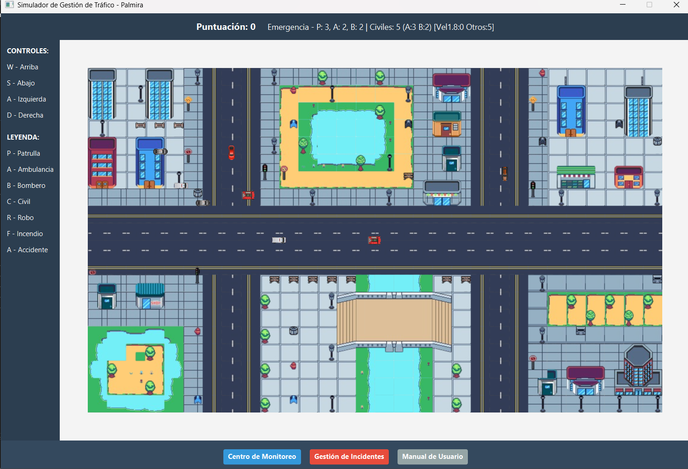
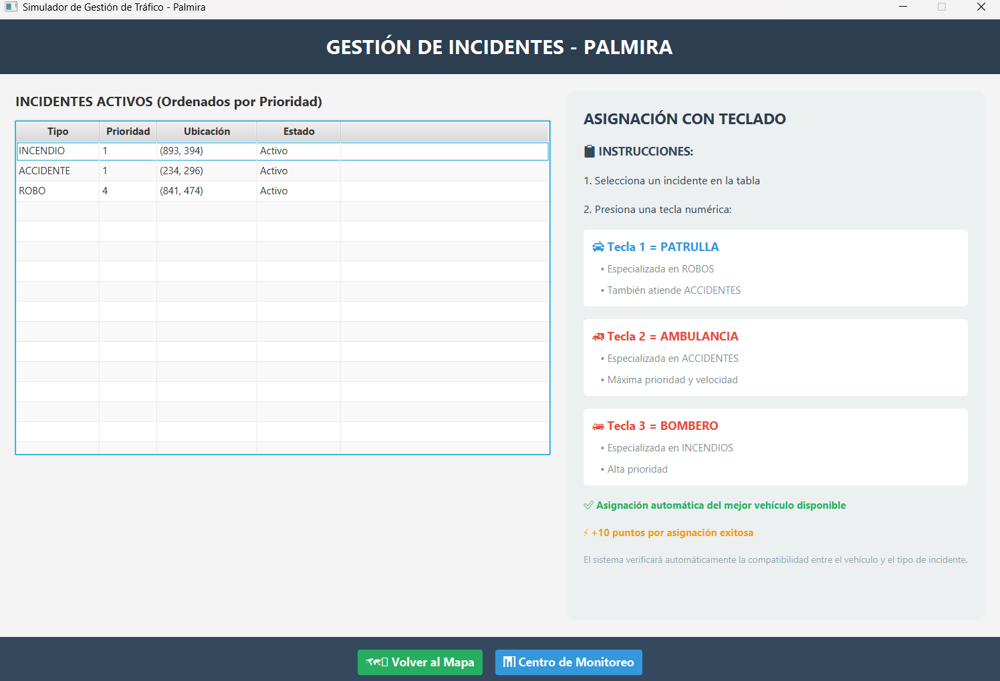
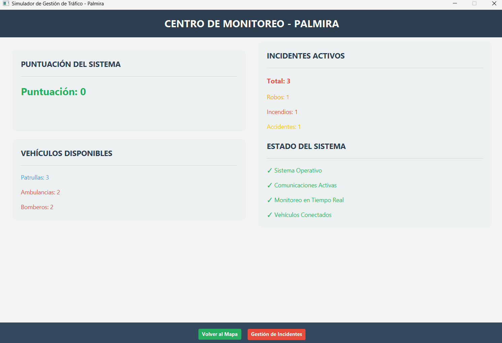
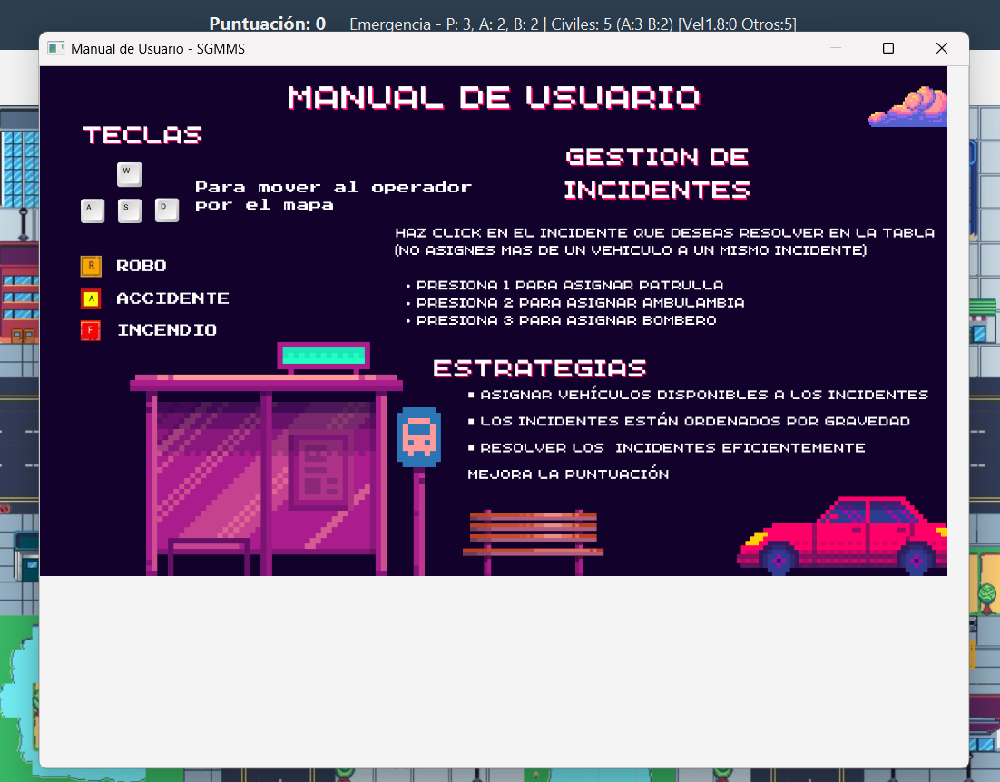

# Palmira Traffic Simulator

Real-time traffic and emergency management simulator developed with **Java 21** and **JavaFX**.

The application simulates traffic in the city of Palmira, Colombia, using autonomous vehicles running concurrently. It includes civilian vehicles and emergency units such as police patrols, ambulances, and fire trucks, which interact with dynamically generated incidents across the map.

The project applies concepts such as **multithreading, object-oriented programming, data structures, event-driven interfaces, and the MVC architectural pattern** to simulate traffic behavior and emergency response in real time.

---


### Traffic Simulation

The main simulation interface displays autonomous civilian and emergency vehicles moving through the map while incidents are generated dynamically.



### Incident Management

Active incidents can be monitored and emergency units can be assigned according to the situation.



### Monitoring Center

The monitoring center provides information about the current state of the simulation and its active elements.



### User Manual

The application includes an integrated user manual that explains the main controls and interactions available during the simulation.



---

## Features

- **Real-time traffic simulation** with autonomous vehicles moving through predefined routes.
- **Multiple vehicle types**, including civilian cars, police patrols, ambulances, and fire trucks, each with different behaviors, speeds, and priorities.
- **Concurrent vehicle execution** using Java threads, allowing vehicles to operate independently during the simulation.
- **Dynamic incident generation**, including robberies, fires, and traffic accidents.
- **Emergency response system** that allows emergency vehicles to be assigned according to the type of incident.
- **Incident prioritization** using a Binary Search Tree (BST) to organize active emergencies.
- **Collision and accident detection** based on interactions between vehicles.
- **Monitoring center** for viewing simulation statistics and current system information.
- **Incident management interface** for reviewing active incidents and assigning emergency units.
- **Interactive map and camera controls** using the WASD keys.
- **Scoring system** that rewards successful emergency assignments.

---

## How It Works

When the application starts, the simulator initializes a set of civilian and emergency vehicles that move autonomously across predefined routes on the map. Each vehicle operates independently, allowing multiple elements of the simulation to run concurrently.

The simulation follows this general flow:

1. **Vehicle initialization**  
   The system creates civilian vehicles, police patrols, ambulances, and fire trucks with different speeds, priorities, and behaviors.

2. **Autonomous traffic simulation**  
   Vehicles move continuously through predefined routes. Civilian vehicles follow their normal paths, while emergency vehicles can respond to incidents when assigned.

3. **Dynamic incident generation**  
   The system periodically generates incidents such as robberies and fires. Traffic accidents can also appear as a result of specific interactions between vehicles.

4. **Incident management**  
   Active incidents are displayed in the incident management interface, where the user can assign an available emergency unit depending on the situation.

5. **Emergency response**  
   Once assigned, the emergency vehicle changes its behavior and travels toward the incident location.

6. **Incident resolution**  
   When the assigned vehicle reaches the incident, the corresponding response process is performed and the incident is resolved.

7. **Monitoring**  
   The monitoring center allows the user to inspect the current state and statistics of the simulation.

---

## Technical Architecture

The project follows a controller-based structure that separates the simulation logic, vehicle and incident models, and JavaFX user interfaces.

### Multithreading

Vehicles are modeled as independent threads. The base `Vehiculo` class extends `Thread`, allowing multiple vehicles to move and update their behavior concurrently during the simulation.

A dedicated `ThreadController` coordinates vehicle threads and background processes such as incident generation and accident detection.

### Object-Oriented Design

The simulation uses an abstract `Vehiculo` class as the base for the different vehicle types:

- `Patrulla` - Police patrol vehicle
- `Ambulancia` - Ambulance used for emergency response
- `Bombero` - Fire truck used to respond to fires
- `Particular` - Civilian vehicle that follows normal traffic routes

Each vehicle type defines its own behavior, speed, priority, and response characteristics.

### Incident Management

Incidents are represented by the `Incidente` model and include situations such as robberies, fires, and traffic accidents.

Active incidents are managed using a custom `BinarySearchTree`, providing a data structure for organizing incidents according to their priority.

### Application State

`GameState` implements a Singleton-based approach to maintain and share the current simulation state between the different controllers and views.

### JavaFX Interface

The graphical interface is built with JavaFX and FXML. Separate views are used for the main simulation, incident management, and monitoring center.

The main controllers include:

- `GameController` - Main simulation view and game loop
- `VehicleController` - Vehicle behavior, rendering, and interactions
- `IncidentController` - Active incident management and visualization
- `IncidentsController` - Incident management interface
- `MonitoringController` - Monitoring interface
- `ThreadController` - Concurrent simulation processes

---

## Technologies

| Technology | Purpose |
|---|---|
| **Java 21** | Core application logic, object-oriented design, and multithreading |
| **JavaFX 21** | Desktop graphical user interface and simulation rendering |
| **FXML** | Definition and organization of application views |
| **Maven** | Dependency management, compilation, and application execution |
| **Maven Wrapper** | Allows the project to run without requiring a separate Maven installation |
| **Git** | Version control |

### Core Concepts

- Object-Oriented Programming (OOP)
- Inheritance and polymorphism
- Abstract classes
- Multithreading and concurrency
- Binary Search Trees (BST)
- MVC-based separation of responsibilities
- Singleton pattern
- Event-driven programming
- JavaFX graphical interfaces

---

## Project Structure

```text
palmira-traffic-simulator/
|
|-- doc/
|   |-- Diagrama de clases integradora 2 APO.pdf
|   `-- screenshots/
|
|-- src/main/
|   |
|   |-- java/
|   |   |-- module-info.java
|   |   `-- org/icesi/implementacionintegradora/
|   |       |
|   |       |-- Main.java
|   |       |
|   |       |-- controllers/
|   |       |   |-- GameController.java
|   |       |   |-- GameState.java
|   |       |   |-- IncidentController.java
|   |       |   |-- IncidentsController.java
|   |       |   |-- MonitoringController.java
|   |       |   |-- ThreadController.java
|   |       |   `-- VehicleController.java
|   |       |
|   |       `-- models/
|   |           |-- Vehiculo.java
|   |           |-- Particular.java
|   |           |-- Patrulla.java
|   |           |-- Ambulancia.java
|   |           |-- Bombero.java
|   |           |-- Incidente.java
|   |           `-- BinarySearchTree.java
|   |
|   `-- resources/
|       |-- Images/
|       `-- org/icesi/implementacionintegradora/
|           |-- game.fxml
|           |-- incidents.fxml
|           `-- monitoring.fxml
|
|-- .gitignore
|-- mvnw
|-- mvnw.cmd
`-- pom.xml
```

---

## Class Diagram

The class diagram provides an overview of the main relationships between the controllers, vehicle hierarchy, incidents, and supporting data structures used by the simulator.

[View the complete class diagram](doc/Diagrama%20de%20clases%20integradora%202%20APO.pdf)

---

## Getting Started

### Prerequisites

To run the project, you need:

- **Java Development Kit (JDK) 21 or later**
- **Git** to clone the repository

A separate Maven installation is not required because the project includes the **Maven Wrapper**.

Verify your Java installation with:

```bash
java -version
```

### Clone the Repository

```bash
git clone https://github.com/YOUR-USERNAME/palmira-traffic-simulator.git
cd palmira-traffic-simulator
```

> Replace `YOUR-USERNAME` with the GitHub username that owns the repository.

### Run on Windows

Using PowerShell or Command Prompt:

```powershell
.\mvnw.cmd clean javafx:run
```

### Run on macOS / Linux

```bash
./mvnw clean javafx:run
```

Maven will automatically download the required dependencies and launch the JavaFX application.

### JAVA_HOME on Windows

If Maven cannot locate your Java installation, make sure the `JAVA_HOME` environment variable is configured.

For the current PowerShell session:

```powershell
$env:JAVA_HOME = Split-Path -Parent (Split-Path -Parent (Get-Command java).Source)
```

Then run the application again:

```powershell
.\mvnw.cmd clean javafx:run
```

---

## Academic Context

This project was developed as a collaborative academic project at **Universidad Icesi**. Its purpose was to apply concepts of object-oriented programming, data structures, multithreading, and graphical user interface development through a real-time traffic and emergency management simulation.

## Authors

Developed collaboratively by:

- Jose David Libreros Alvarez
- Juan Diego Garces Orejuela
- Samuel Steban Granda Munoz
